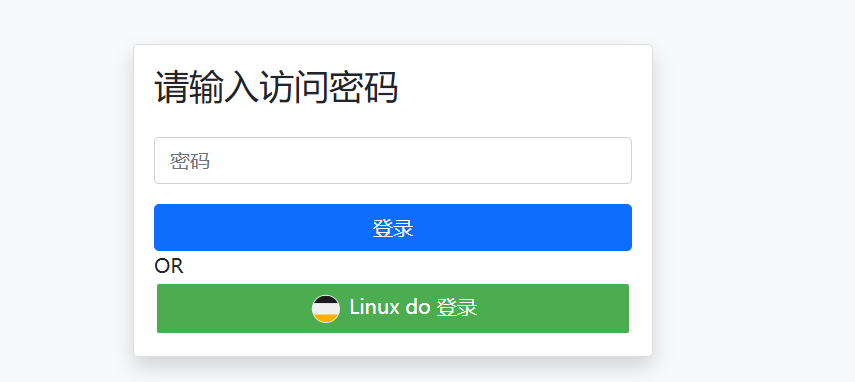

# plist

## 项目简介

`plist` 是一个基于 Go 的在线图片分类展示工具，支持静态和动态加载图片，提供简单的认证功能。




## 功能特性

- **图片分类展示**：支持按目录分类展示图片。
- **动态加载**：支持动态加载分类和图片，提升用户体验。
- **认证功能**：通过密码保护访问，未认证用户需登录。
- **分页支持**：分类和图片支持分页加载。
- **自定义配置**：通过编辑config.yaml文件自定义站点配置。
- **第三方登录**：Linux do

## 配置config.yaml文件

自定义站点配置：

- `image_dir`：图片目录路径（默认值：`./images`）。
- `secure`：是否开启密码访问，默认关闭为 `false`。
- `password`：访问密码（默认值：空）。
- `port`：服务端口（默认值：`8008`）。
- `title`：站点标题（默认值：`在线图集`）。
- `icon`：站点图标 URL（默认值：`https://i.051214.xyz/favicon.ico`）。
- `dynamic`：是否启用动态加载（默认值：`true`启用）。
- `web_adderss`：站点地址，接入Linux do 登录必须设置（默认值 `http://localhost:8008`）
- `linuxdo_enable`：设置是否接入Linux do 登录，设置 `true` 开启（默认值为 `false`）
- `linuxdo_client_id`：Linux do 客户端ID , https://connect.linux.do 中获取
- `linuxdo_client_secret`：Linux do 客户端密钥

## 启动项目

### Docker

1. docker 直接运行

```shell
docker run -p 8008:8008 -v /images:/app/images -v ./conf:/conf --restart always kukudebai/plist:latest
```

2. docker-compose

```yaml
services:
    plist:
        image: 'kukudebai/plist:latest'
        restart: always
        volumes:
            - './images:/app/images'
            - './conf:/conf'
        ports:
            - '8008:8008'
```

### 二进制运行

1. 从Release下载系统对应版本
2. 配置config.yaml文件
3. 直接运行即可，注册为后台服务请查阅相关文档
   - [https://cn.bing.com/search?q=%E5%B0%86%E7%A8%8B%E5%BA%8F%E8%BF%9B%E7%A8%8B%E6%B3%A8%E5%86%8C%E4%B8%BALinux%E7%B3%BB%E7%BB%9F%E6%9C%8D%E5%8A%A1](https://cn.bing.com/search?q=%E5%B0%86%E7%A8%8B%E5%BA%8F%E8%BF%9B%E7%A8%8B%E6%B3%A8%E5%86%8C%E4%B8%BALinux%E7%B3%BB%E7%BB%9F%E6%9C%8D%E5%8A%A1)
   - [https://cn.bing.com/search?q=%E5%B0%86%E7%A8%8B%E5%BA%8F%E8%BF%9B%E7%A8%8B%E6%B3%A8%E5%86%8C%E4%B8%BAwindows%E6%9C%8D%E5%8A%A1](https://cn.bing.com/search?q=%E5%B0%86%E7%A8%8B%E5%BA%8F%E8%BF%9B%E7%A8%8B%E6%B3%A8%E5%86%8C%E4%B8%BAwindows%E6%9C%8D%E5%8A%A1)

### 源码运行

1. 确保已安装 Go 环境。
2. 将项目克隆到本地并进入项目目录。
3. 使用以下命令运行项目：
   ```sh
   go run .
   ```

## 路由说明

- `/`：主页面，展示图片分类。
- `/category/{分类名}`：分类页面，展示分类下的图片。
- `/login`：登录页面，用于认证访问。
- `/api/index`：获取分类的 JSON 数据（动态模式）。
- `/api/category/{分类名}`：获取分类下图片的 JSON 数据（动态模式）。
- `/images/{分类名}/{图片名}`：访问图片文件。
